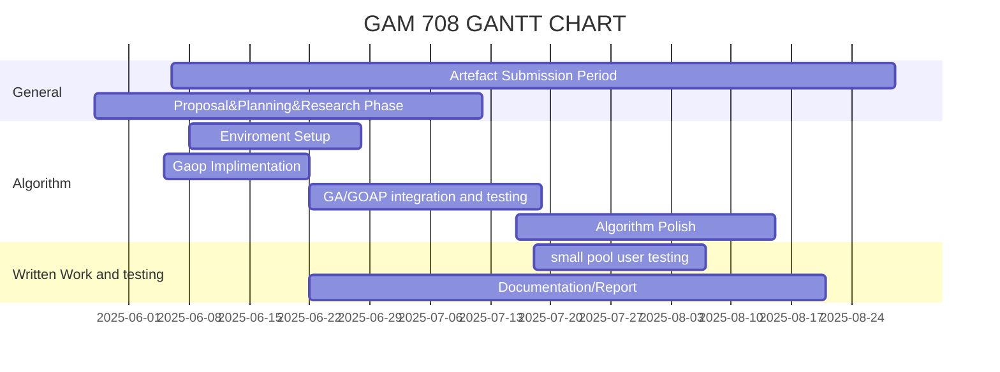

GOAP progress

```csharp
using System.Linq;
public namespace Goap
{

    public class world_state
    {
        public string key
        {
            get; set;
        }
        public int value
        {
            get; set;
        }
    }

    public class World_States()
    {
        public Dictionary<string, int> states;
        public init()
        {
            states = new Dictionary<string, int>();
        }
        public bool has_state(string key)
        {
            return states.ContainsKey(key);
        }
        void add_state(string key, int value)
        {
            states.Add(key, value);
        }
        public bool check_is_valid(string input, int value)
        {
            if (states[input] == value) return true;
            return false;
        }
    }

    public abstract class GOAP_Component()
    {
        public virtual int id = -1;
        public virtual float cost;
        public virtual string name = "Not Named";
    }


    public abstract class Action : GOAP_Component
    {
        public override float cost;
        public override string name = "Not Named";

        public
        
        public virtual void action_definition(string name, float cost) { }
        public virtual void execute() { }

    }


    public abstract class Belief:GOAP_Component
    {
        public float priority = 1f;
        public List<string> want_satisfied;
        public List<string> blacklist;
        public virtual void init() { }
    }


    public class shrimple()
    {
        public static List<Action> Planner(List<Belief> goals)
        {
            return new List<Action>();
        }
    }

    }


```