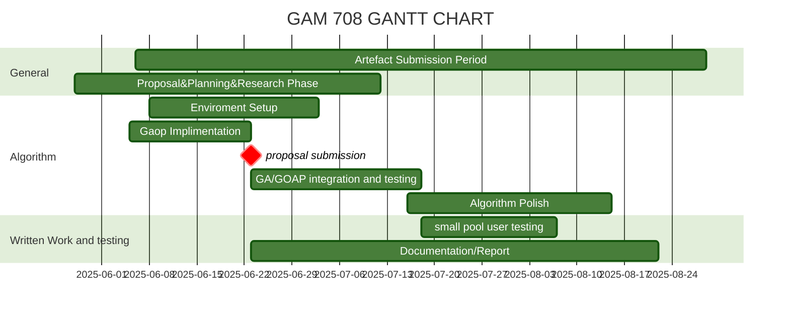

GOAP progress


//add milestone

a


a
a


a


a


```csharp

uusing System.Linq;
using System;
public namespace Goap
{

    public class world_state
    {
        public string key
        {
            get; set;
        }
        public int value
        {
            get; set;
        }
    }

    public class World_States()
    {
        public Dictionary<string, int> states;
        public init()
        {
            states = new Dictionary<string, int>();
        }
        public bool has_state(string key)
        {
            return states.ContainsKey(key);
        }
        void add_state(string key, int value)
        {
            states.Add(key, value);
        }
        public bool check_is_valid(string input, int value)
        {
            if (states[input] == value) return true;
            return false;
        }
    }

    public abstract class GOAP_Component()
    {
        public virtual int id = -1;
        public virtual string name = "Not Named";
    }


    public abstract class Action : GOAP_Component
    {
        public float cost;
        public override string name = "Not Named";
        public virtual void action_definition(string name, float cost) { }
        public virtual void execute() { }

    }

    public class BeliefFactory()
    {
        public int id;
        public goap_agent agent;

        public Dictionary<string, Belief> beliefs;

        public BeliefFactory(GOAP_AGENT agent, int id, Dictionary<string, Belief> beliefs)
        {
            this.agent = agent;
            this.id = id;
            this.beliefs = beliefs;
        }
        public void add_belief(string key, func<float> condition)
        {
            beliefs.Add(key, new Belief.Builder(key)
            .add_condition(condition)
            .Build());
        }


new fuzzy_value = (current_value - smallest_value)  /(biggest_value - smallest_value)


        public void add_location_belief(string key, func<Vector2> location, float dist)
        {
            beliefs.Add(key, new Belief.Builder(key).add_location(() => ).add_condition(whether_true))


        }

    }
    

    public class Belief : GOAP_Component
    {
        public string Name { get; }
        Func<float> condition = () => 0.0f;
        Func<Vector2> observed_location = () => Vector2.zero;
        public Vector2 location;
        public class Builder()
        {
            public Belief belief;

            public Builder(string name)
            {
                belief = new Belief(name);
            }

            public Builder add_condition(Func<float> condition)
            {
                belief.condition = condition;
                return this;
            }
            public Builder add_location(Func<Vector2> observed_location)
            {
                belief.observed_location = observed_location;
                return this;
            }
            public Belief Build()
            {
                return this;
            }
        }
        //   public Dictionary<string, GOAP_Component> goals;

        /*        public Belief Belief(List<string> want_satisfied)
                {
                    for (var i = 0; i < want_satisfied.length; i++)
                    {
                        goals.Add(find_goal(want_satisfied[i]));
                    }
                }*/
    }


    public class shrimple()
    {
        public static List<Action> Planner()
        {
            return new List<Action>();
        }
    }

    }


```