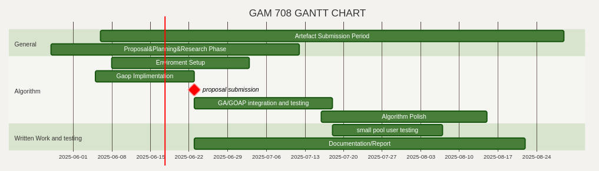
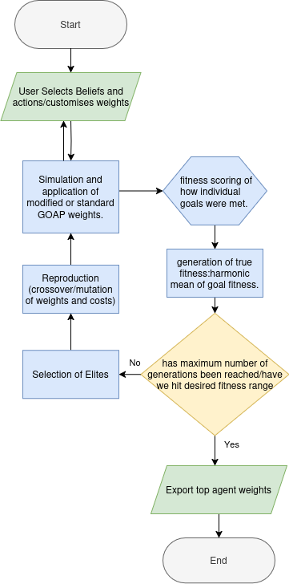

# Gam706: GOAP/GA Hybrid. 
Chlo Gaddum
---
---
# Project Overview and Context.

* "How can a union between GOAP and GP assist a designer when developing NPC's"
* Project context.
* Why?
---
# Audience.
#
* Who are they?
#
* What might they want?
#
* Audience Feedback and eithical concerns?
---
# Project Specifics

  
    

---
# Supporting Key Evidence. 
Schwab and Hlavacs, ‘Capturing the Essence’;
ORKIN, ‘Applying Goal-Oriented Action Planning to Games’; 

---
